# 30天JavaScript编程挑战

 <!--  <strong>Learn with Asabeneh by joining the upcoming [<em>CODING BOOTCAMP</em>](https://docs.google.com/forms/d/e/1FAIpQLSf0oNIYR9XU1DCctfl-pY36KbWse-SQX5aQaUgetqSinFYnmQ/viewform) </strong> -->


| # 天数 |                                                                       主题                                                                          |
| ----- | :-------------------------------------------------------------------------------------------------------------------------------------------------: |
| 01    |                                                             [简介](./README.md)                                                                      |
| 02    |                                               [数据类型](./02_Day_Data_types/02_day_data_types.md)                                                   |
| 03    |                             [布尔值、运算符、日期](./03_Day_Booleans_operators_date/03_booleans_operators_date.md)                                     |
| 04    |                                            [条件语句](./04_Day_Conditionals/04_day_conditionals.md)                                                  |
| 05    |                                                     [数组](./05_Day_Arrays/05_day_arrays.md)                                                        |
| 06    |                                                       [循环](./06_Day_Loops/06_day_loops.md)                                                        |
| 07    |                                                 [函数](./07_Day_Functions/07_day_functions.md)                                                      |
| 08    |                                                    [对象](./08_Day_Objects/08_day_objects.md)                                                       |
| 09    |                             [高阶函数](./09_Day_Higher_order_functions/09_day_higher_order_functions.md)                                             |
| 10    |                                           [集合和映射](./10_Day_Sets_and_Maps/10_day_Sets_and_Maps.md)                                               |
| 11    |                      [解构和展开](./11_Day_Destructuring_and_spreading/11_day_destructuring_and_spreading.md)                                        |
| 12    |                                  [正则表达式](./12_Day_Regular_expressions/12_day_regular_expressions.md)                                            |
| 13    |                             [控制台对象方法](./13_Day_Console_object_methods/13_day_console_object_methods.md)                                        |
| 14    |                                         [错误处理](./14_Day_Error_handling/14_day_error_handling.md)                                                 |
| 15    |                                                    [类](./15_Day_Classes/15_day_classes.md)                                                         |
| 16    |                                                        [JSON](./16_Day_JSON/16_day_json.md)                                                        |
| 17    |                                            [Web存储](./17_Day_Web_storages/17_day_web_storages.md)                                                  |
| 18    |                                                  [Promise(异步)](./18_Day_Promises/18_day_promises.md)                                                   |
| 19    |                                                   [闭包](./19_Day_Closures/19_day_closures.md)                                                      |
| 20    |                                  [编写整洁代码](./20_Day_Writing_clean_codes/20_day_writing_clean_codes.md)                                          |
| 21    |                                                          [DOM](./21_Day_DOM/21_day_dom.md)                                                         |
| 22    |                            [操作DOM对象](./22_Day_Manipulating_DOM_object/22_day_manipulating_DOM_object.md)                                        |
| 23    |                                        [事件监听器](./23_Day_Event_listeners/23_day_event_listeners.md)                                              |
| 24    |                             [小项目：太阳系](./24_Day_Project_solar_system/24_day_project_solar_system.md)                                           |
| 25    | [小项目：世界国家数据可视化1](./25_Day_World_countries_data_visualization_1/25_day_world_countries_data_visualization_1.md)                            |
| 26    | [小项目：世界国家数据可视化2](./26_Day_World_countries_data_visualization_2/26_day_world_countries_data_visualization_2.md)                            |
| 27    |                             [小项目：作品集](./27_Day_Mini_project_portfolio/27_day_mini_project_portfolio.md)                                       |
| 28    |                          [小项目：排行榜](./28_Day_Mini_project_leaderboard/28_day_mini_project_leaderboard.md)                                      |
| 29    |             [小项目：角色动画](./29_Day_Mini_project_animating_characters/29_day_mini_project_animating_characters.md)                               |
| 30    |                                     [最终项目](./30_Day_Mini_project_final/30_day_mini_project_final.md)                                            |

  <!-- <strong>Learn with Asabeneh by joining the upcoming [<em>CODING BOOTCAMP</em>](https://docs.google.com/forms/d/e/1FAIpQLSf0oNIYR9XU1DCctfl-pY36KbWse-SQX5aQaUgetqSinFYnmQ/viewform) </strong> -->

🧡🧡🧡 祝你编程愉快 🧡🧡🧡

<div align="center">

<h1> 30天JavaScript：简介</h1>
<a class="header-badge" target="_blank" href="https://www.linkedin.com/in/asabeneh/">

</a>
<a class="header-badge" target="_blank" href="https://twitter.com/Asabeneh">

</a>

<sub>作者：
<a href="https://www.linkedin.com/in/asabeneh/" target="_blank">Asabeneh Yetayeh</a>
<small> 2020年1月</small>
</sub>

<sub>中文翻译及校对：
<a href="https://github.com/DoYoungDo" target="_blank">Doyoung</a>
<small> 2025年11月</small>
</sub>

<div>

🇬🇧 [英文](../readMe.md)
🇪🇸 [西班牙语](../Spanish/readme.md)
🇮🇹 [意大利语](../Italian/readMe.md)
🇷🇺 [俄语](../RU/README.md)
🇹🇷 [土耳其语](../Turkish/readMe.md)
🇦🇿 [阿塞拜疆语](../Azerbaijani/readMe.md)
🇰🇷 [韩语](../Korea/README.md)
🇻🇳 [越南语](../Vietnamese/README.md)
🇵🇱 [波兰语](../Polish/readMe.md)
🇧🇷 [葡萄牙语](../Portuguese/readMe.md)

</div>

</div>


[第2天 >>](./02_Day_Data_types/02_day_data_types.md)


- [30天JavaScript](#30天javascript)
- [📔 第1天](#-第1天)
  - [简介](#简介)
  - [要求](#要求)
  - [设置](#设置)
    - [安装Node.js](#安装nodejs)
    - [浏览器](#浏览器)
      - [安装Google Chrome](#安装google-chrome)
      - [打开Google Chrome控制台](#打开google-chrome控制台)
      - [在浏览器控制台中编写代码](#在浏览器控制台中编写代码)
        - [Console.log](#consolelog)
        - [带多个参数的Console.log](#带多个参数的consolelog)
        - [注释](#注释)
        - [语法](#语法)
      - [算术运算](#算术运算)
    - [代码编辑器](#代码编辑器)
      - [安装Visual Studio Code](#安装visual-studio-code)
      - [如何使用Visual Studio Code](#如何使用visual-studio-code)
  - [将JavaScript添加到网页](#将javascript添加到网页)
    - [内联脚本](#内联脚本)
    - [内部脚本](#内部脚本)
    - [外部脚本](#外部脚本)
    - [多个外部脚本](#多个外部脚本)
  - [数据类型简介](#数据类型简介)
    - [数字](#数字)
    - [字符串](#字符串)
    - [布尔值](#布尔值)
    - [未定义](#未定义)
    - [空值](#空值)
  - [检查数据类型](#检查数据类型)
  - [再次讨论注释](#再次讨论注释)
  - [变量](#变量)
- [💻 第1天：练习](#-第1天练习)

# 📔 第1天

## 简介

**恭喜你**决定参加30天JavaScript编程挑战。在这个挑战中，你将学习成为一名JavaScript程序员所需的一切知识，以及一般的编程概念。挑战结束时，你将获得30DaysOfJavaScript编程挑战完成证书。如果你需要帮助或想帮助他人，可以加入专门的[电报群](https://t.me/ThirtyDaysOfJavaScript)。

**30DaysOfJavaScript**挑战是初学者和高级JavaScript开发者的指南。欢迎来到JavaScript的世界。JavaScript是网络的语言。我喜欢使用和教授JavaScript，希望你也一样。

在这个循序渐进的JavaScript挑战中，你将学习JavaScript——人类历史上最受欢迎的编程语言。
JavaScript被**用于为网站添加交互性，开发移动应用、桌面应用、游戏**，如今JavaScript还可以用于**服务器端编程**、**机器学习**和**人工智能**。

**JavaScript（JS）**近年来越来越受欢迎，在过去十年中一直是领先的编程语言，是GitHub上使用最多的编程语言。

这个挑战易于阅读，用对话式英语编写，引人入胜、激励人心，同时要求也很高。你需要投入大量时间来完成这个挑战。如果你是视觉学习者，可以在<a href="https://www.youtube.com/channel/UC7PNRuno1rzYPb1xLa4yktw">Washera</a>YouTube频道上获取视频课程。订阅频道，在YouTube视频上评论和提问，积极主动，作者最终会注意到你。

作者喜欢听到你对挑战的看法，通过表达你对30DaysOfJavaScript挑战的想法来分享作者。你可以在这个[链接](https://www.asabeneh.com/testimonials)上留下你的推荐语。

## 要求

参加这个挑战不需要任何编程知识。你只需要：

1. 动力
2. 一台电脑
3. 网络
4. 一个浏览器
5. 一个代码编辑器

## 设置

我相信你有动力和强烈的愿望成为一名开发者，有一台电脑和网络。如果你具备这些，那么你就有了开始所需的一切。

### 安装Node.js

你现在可能不需要Node.js，但以后可能会需要。安装[node.js](https://nodejs.org/zh-cn)。

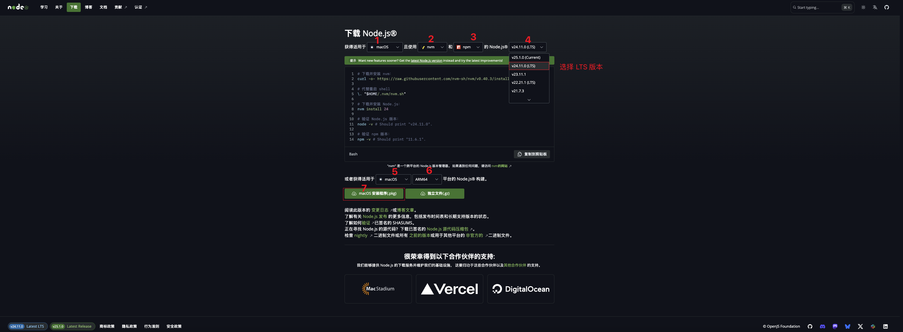

下载后双击安装

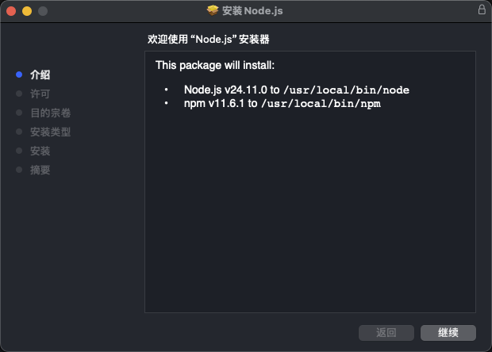

我们可以通过打开设备终端或命令提示符来检查本地机器上是否安装了node。

```sh
~ $ node -v
v20.19.4
```

制作本教程时我使用的是Node 20.19.4版本，但现在推荐下载的Node.js版本是v24.11.0，到你使用这个材料时可能会有更高的Node.js版本。

### 浏览器

有很多浏览器可供选择。然而，我强烈推荐Microsoft Edge（使用的是Chrome内核，我更建议使用Edge的原因是在国内有更好的支持） 或 Google Chrome。

#### 安装Microsoft Edge

如果你还没有Microsoft Edge，请安装[Microsoft Edge](https://www.microsoft.com/zh-cn/edge/download)。我们可以在浏览器控制台上编写小型JavaScript代码，但我们不使用浏览器控制台来开发应用程序。


#### 打开Microsoft Edge控制台

你可以通过点击浏览器右上角的三点菜单，选择"更多工具 -> 开发者工具"，或者使用键盘快捷键来打开Microsoft Edge控制台。我更喜欢使用快捷键。

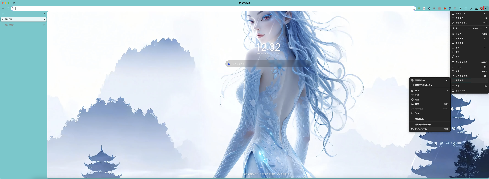

使用键盘快捷键打开Edge控制台：

```sh
Mac
Command+Option+J | F12

Windows/Linux:
Ctl+Shift+J | F12
```


打开Microsoft Edge控制台后，尝试探索标记的按钮。我们将大部分时间花在控制台上。控制台是你的JavaScript代码运行的地方。Google V8引擎将你的JavaScript代码转换为机器代码。
让我们在Microsoft Edge控制台上编写JavaScript代码：

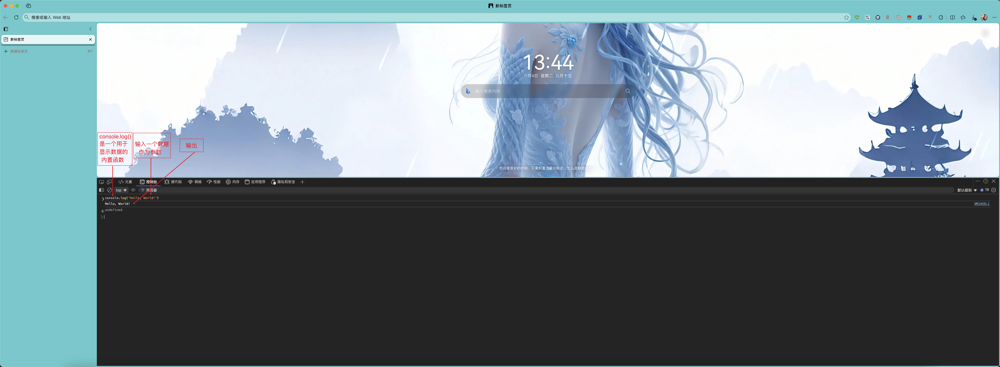

#### 在浏览器控制台中编写代码

我们可以在Google控制台或任何浏览器控制台上编写任何JavaScript代码。然而，对于这个挑战，我们只关注Google Chrome控制台。使用以下方式打开控制台：

```sh
Mac
Command+Option+I

Windows:
Ctl+Shift+I
```

##### Console.log

为了编写我们的第一行JavaScript代码，我们使用了一个内置函数**console.log()**。我们传入一个参数作为输入数据，函数显示输出。我们在console.log()函数中传入`'Hello, World'`作为输入数据或参数。

```js
console.log('Hello, World!')
```

##### 带多个参数的Console.log

**`console.log()`**函数可以接受多个用逗号分隔的参数。语法如下：**`console.log(param1, param2, param3)`**

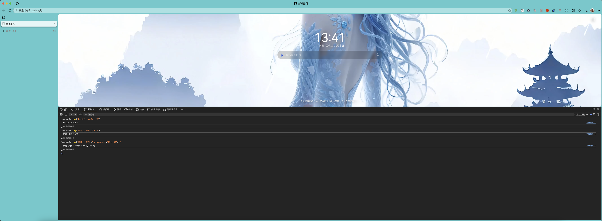

```js
console.log('hello','world','!')
console.log('新年','快乐','2025')
console.log('欢迎','来到','javascript','的','30','天')
```

从上面的代码片段可以看出，_`console.log()`_可以接受多个参数。

恭喜你！你使用_`console.log()`_编写了第一行JavaScript代码。

##### 注释

我们可以给代码添加注释。注释对于使代码更易读和在我们的代码中留下备注非常重要。JavaScript不执行我们代码的注释部分。在JavaScript中，任何以//开头的文本行都是注释，任何像这样`//`包围的内容也是注释。

**示例：单行注释**

```js
// 这是第一个注释  
// 这是第二个注释  
// 我是单行注释
```

**示例：多行注释**

```js
/*
这是多行注释  
 多行注释可以占用多行  
 JavaScript是网络的语言  
 */
```

##### 语法

编程语言类似于人类语言。英语或许多其他语言使用单词、短语、句子、复合句等来传达有意义的信息。英语中语法的意思是_在语言中创建格式正确的句子的单词和短语的排列_。语法的技术定义是计算机语言中语句的结构。编程语言有语法。JavaScript是一种编程语言，像其他编程语言一样，它有自己的语法。如果我们不编写JavaScript能理解的语法，它会引发不同类型的错误。我们将在后面探讨不同种类的JavaScript错误。现在，让我们看看语法错误。


我故意犯了一个错误。结果，控制台引发语法错误。实际上，语法信息非常丰富。它告知犯了什么类型的错误。通过阅读错误反馈指南，我们可以纠正语法并解决问题。识别和从程序中删除错误的过程称为调试。让我们修复错误：

```js
console.log('Hello, World!')
console.log('Hello, World!')
```

到目前为止，我们看到了如何使用_`console.log()`_显示文本。如果我们使用_`console.log()`_打印文本或字符串，文本必须在单引号、双引号或反引号内。
**示例：**

```js
console.log('Hello, World!')
console.log("Hello, World!")
console.log(`Hello, World!`)
```

#### 算术运算

现在，让我们在Google Chrome控制台上练习使用_`console.log()`_编写JavaScript代码，用于数字数据类型。
除了文本，我们还可以使用JavaScript进行数学计算。让我们做以下简单的计算。
可以在Google Chrome控制台上直接编写JavaScript代码，无需**_`console.log()`_**函数。然而，它包含在本介绍中，因为这个挑战的大部分内容将在文本编辑器中进行，在那里该函数的使用将是强制性的。你可以直接在控制台上使用指令进行练习。


```js
console.log(2 + 3) // 加法
console.log(3 - 2) // 减法
console.log(2 * 3) // 乘法
console.log(3 / 2) // 除法
console.log(3 % 2) // 取模 - 求余数
console.log(3 ** 2) // 指数 3 ** 2 == 3 * 3
```

### 代码编辑器

我们可以在浏览器控制台上编写代码，但这不适用于更大的项目。在真实的工作环境中，开发人员使用不同的代码编辑器来编写代码。在这个30天JavaScript挑战中，我们将使用Visual Studio Code。

#### 安装Visual Studio Code

Visual Studio Code是一个非常流行的开源文本编辑器。我推荐[下载Visual Studio Code](https://code.visualstudio.com/)，但如果你喜欢其他编辑器，请随意使用你已有的。

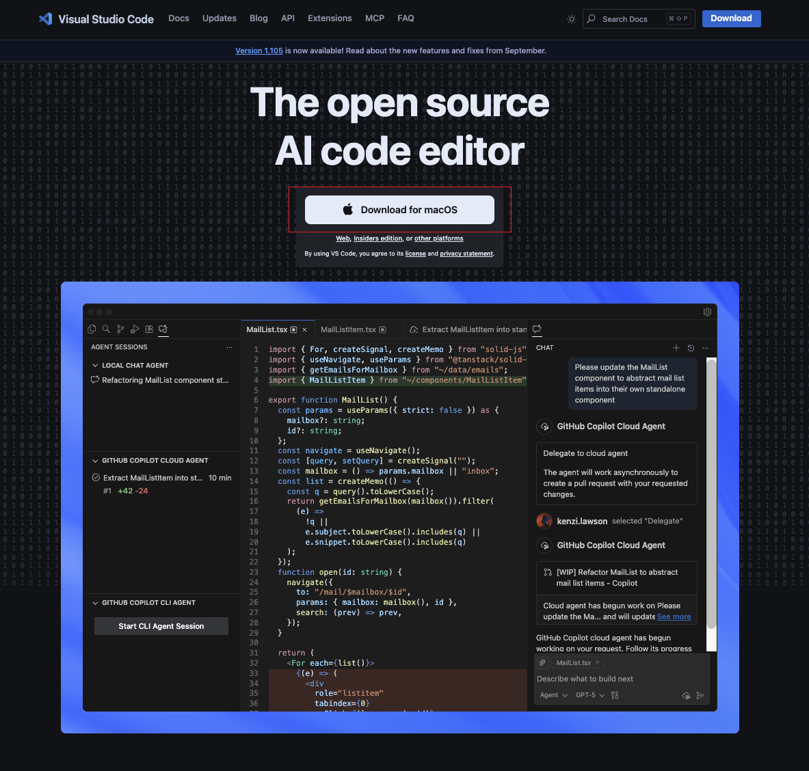

如果你安装了Visual Studio Code，让我们开始使用它。

#### 如何使用Visual Studio Code

双击图标打开Visual Studio Code。当你打开它时，你会得到这种界面。尝试与标记的图标进行交互。


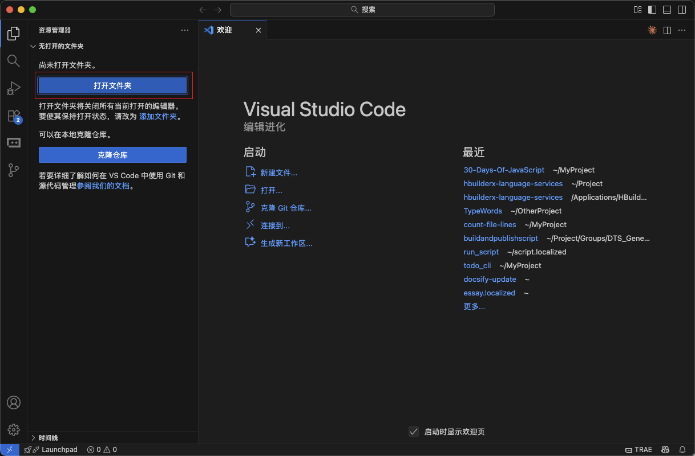

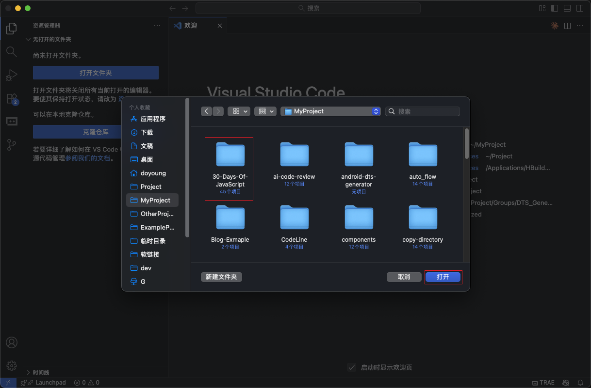

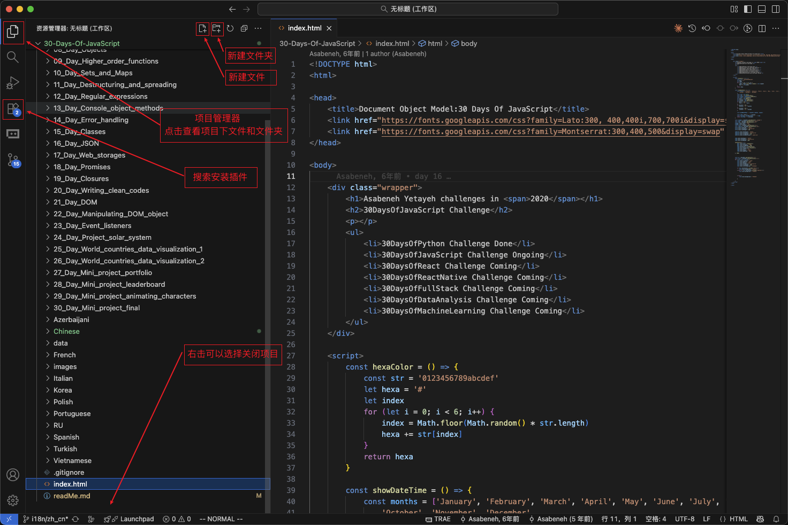

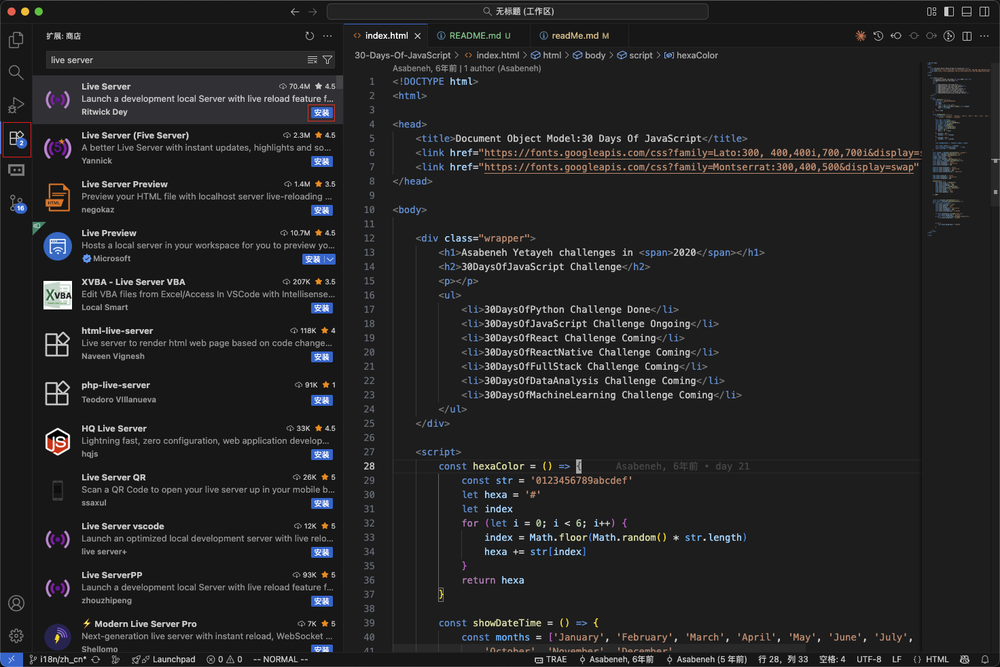

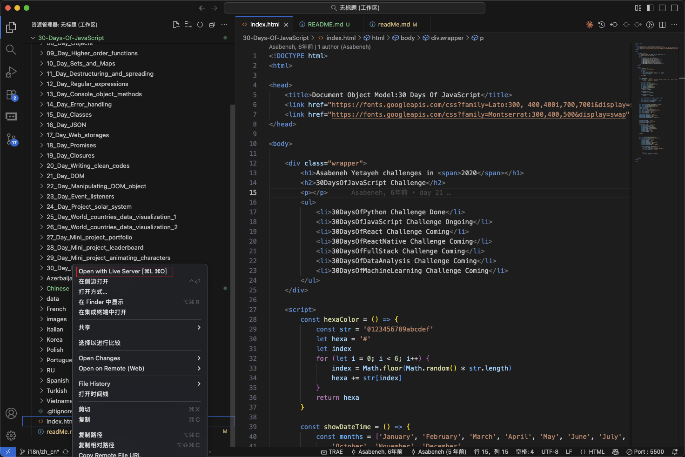

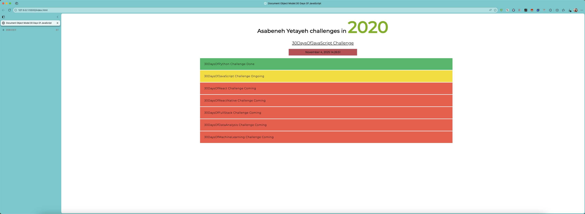

## 将JavaScript添加到网页

JavaScript可以通过三种不同的方式添加到网页：

- **_内联脚本_**
- **_内部脚本_**
- **_外部脚本_**
- **_多个外部脚本_**

以下部分显示了将JavaScript代码添加到网页的不同方法。
